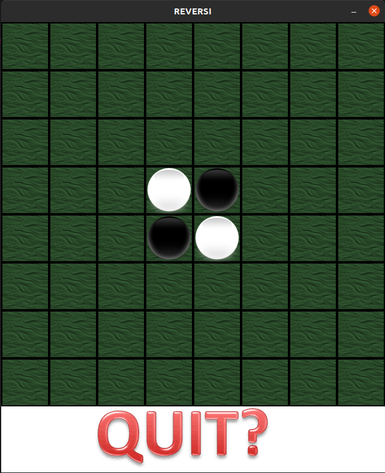

# Othello (game) (Work In Progrss....)

A multiplayer game created using tcp server

<p>
    </img>
</p>

## Prerequisites

### 1. C++17 Compiler

### 2. SDL libc++

### 3. Boost lib

---

## Installation (Linux)

### 1. SDL

```bash
$ sudo apt install libsdl2-dev
```

```bash
$ sudo apt install libsdl2-ttf-dev
```

```bash
$ sudo apt install libsdl2-image-dev
```

```bash
$ sudo apt install libsdl2-net-dev
```

### 2. Boost Library (ASIO)

```bash
$ sudo apt install libboost-dev
```

```bash
$ sudo apt install libboost-all-dev
```

<br>

## Setup sever (JS)

### 1. `npm install`

### 2. `npm run start`

You will see server started listening on PORT `8080`

## Run IT(client)

```bash
$ make && ./main
```
